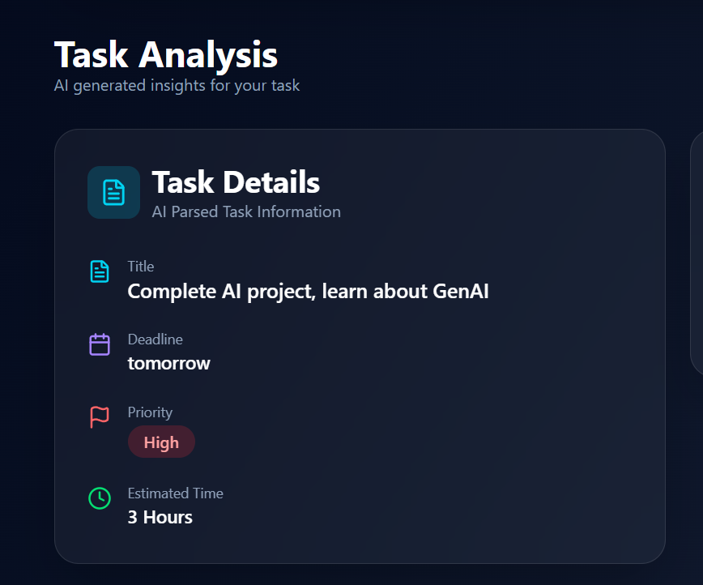
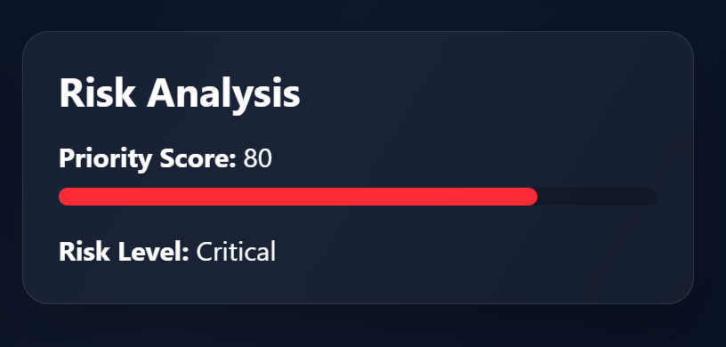

# 🚀 Deadline Guardian

<div align="center">

### AI-Powered Productivity Assistant that Prevents Missed Deadlines

Analyze tasks using **Gemini AI**, predict deadline risks, generate intelligent rescue plans, and stay organized with Google Calendar integration.

<p>


</p>

</div>

---

# 🌐 Live Demo

### Frontend

> https://deadline-guardian-500717.web.app

### Backend API

> https://deadline-guardian-api-477837174358.asia-south1.run.app

---

# ✨ Features

* 🤖 AI-powered natural language task parsing using Gemini 2.5 Flash
* ⚡ Intelligent priority prediction
* 🚨 Deadline risk analysis engine
* 🛟 AI-generated rescue plans
* 📅 Google Calendar integration
* 📊 Interactive dashboard with analytics
* 📈 Productivity statistics
* 🌙 Dark / Light mode
* 📱 Responsive modern UI
* ☁️ Cloud deployment using Firebase & Google Cloud Run

---

# 🖼️ Screenshots

## Dashboard


---

## Task Analysis



---

## Risk Analysis



---

## Rescue Plan


---

## Task History


---

# 🏗️ System Architecture

```text
                User
                  │
                  ▼
        React + Vite Frontend
                  │
                  ▼
         Firebase Hosting
                  │
      HTTPS REST API Calls
                  │
                  ▼
      FastAPI Backend (Cloud Run)
                  │
      ┌───────────┴───────────┐
      ▼                       ▼
 Gemini AI API          SQLite Database
      │                       │
      └───────────┬───────────┘
                  ▼
          AI Generated Response
                  │
                  ▼
          Interactive Dashboard
```

---

# 🛠️ Tech Stack

## Frontend

* React
* Vite
* Tailwind CSS
* Framer Motion
* Axios
* Lucide Icons

## Backend

* FastAPI
* SQLAlchemy
* SQLite
* Gemini AI SDK
* Pydantic

## Deployment

* Firebase Hosting
* Google Cloud Run
* Docker

---

# 📂 Project Structure

```
deadline-guardian
│
├── backend
│   ├── app
│   ├── routes
│   ├── services
│   ├── models
│   ├── Dockerfile
│   └── requirements.txt
│
├── frontend
│   ├── src
│   │   ├── components
│   │   ├── pages
│   │   ├── services
│   │   └── assets
│   ├── public
│   └── package.json
│
├── screenshots
├── README.md
└── LICENSE
```

---

# 🚀 Installation

## Clone Repository

```bash
git clone https://github.com/Mayank-123ag/deadline-guardian.git

cd deadline-guardian
```

---

## Backend

```bash
cd backend

python -m venv venv

venv\Scripts\activate

pip install -r requirements.txt

uvicorn app.main:app --reload
```

---

## Frontend

```bash
cd frontend

npm install

npm run dev
```

---

# 🔐 Environment Variables

Backend

```env
GEMINI_API_KEY=YOUR_API_KEY
```

Frontend

```env
VITE_API_URL=https://YOUR_CLOUD_RUN_URL.run.app
```

---

# 📡 API Endpoints

| Method | Endpoint               | Description                 |
| ------ | ---------------------- | --------------------------- |
| POST   | `/parse-task/`         | Parse natural language task |
| POST   | `/priority/`           | Predict task priority       |
| POST   | `/rescue/`             | Generate AI rescue plan     |
| GET    | `/tasks/`              | Retrieve task history       |
| POST   | `/tasks/`              | Save a task                 |
| PATCH  | `/tasks/{id}/complete` | Mark task complete          |
| DELETE | `/tasks/{id}`          | Delete task                 |

---

# 🎯 Future Improvements

* 🔐 User Authentication
* 👥 Team Collaboration
* 📧 Email Reminders
* 📱 Mobile App
* 📊 Advanced Analytics
* 🔔 Push Notifications
* 🤖 AI Chat Assistant
* 📅 Outlook Calendar Integration
* ☁️ PostgreSQL Database
* 🧠 ML-based Deadline Prediction

---

# 👨‍💻 Author

**Mayank Agrawal**

GitHub

https://github.com/Mayank-123ag

---

## ⭐ If you found this project interesting, consider giving it a star!
